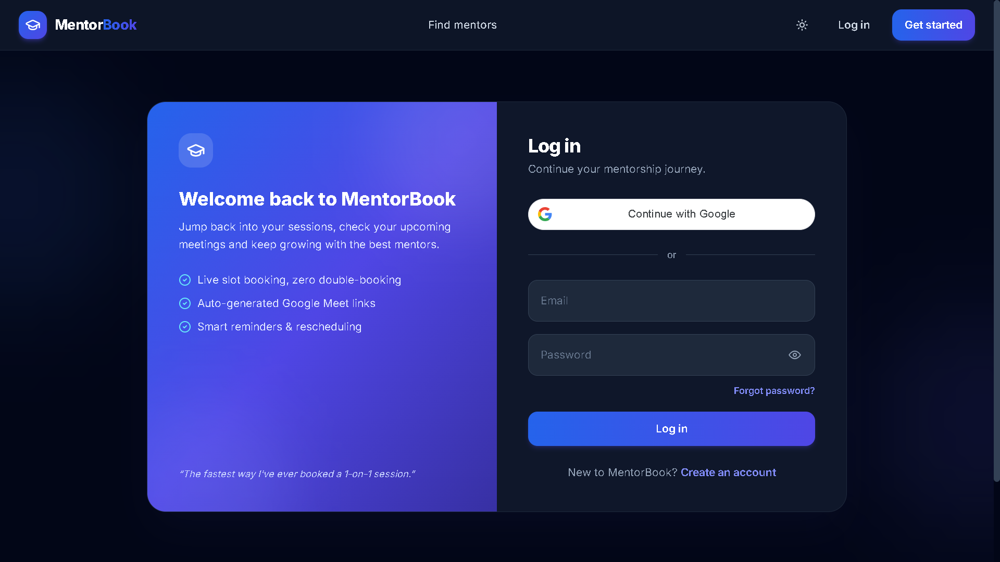
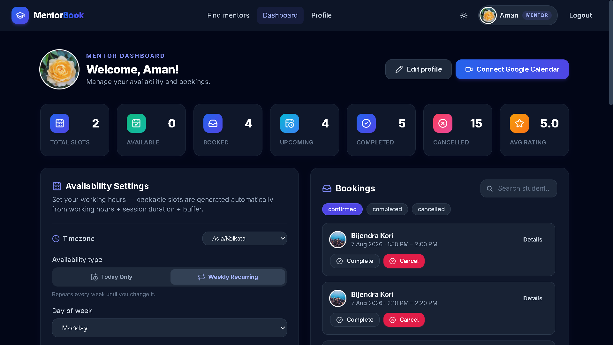
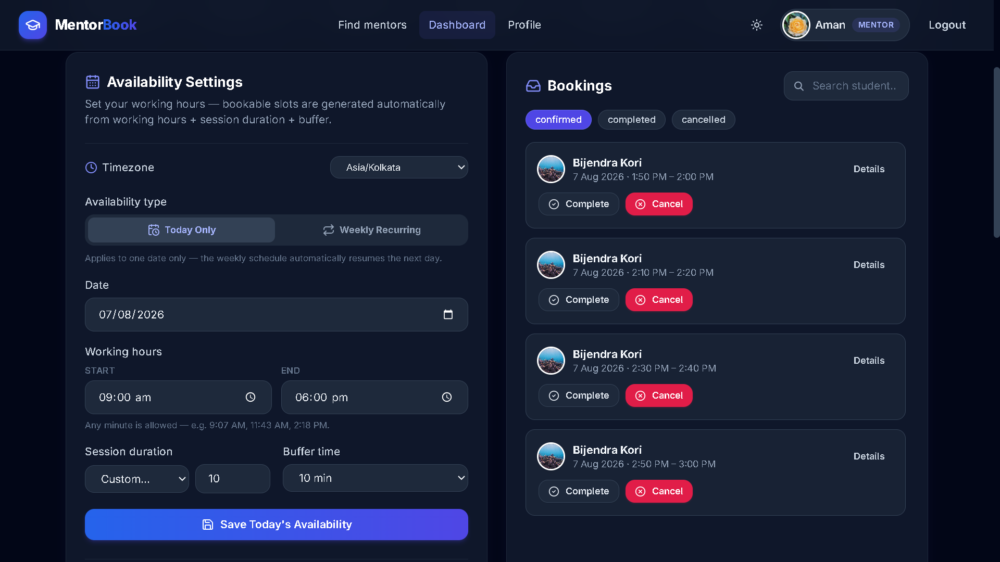
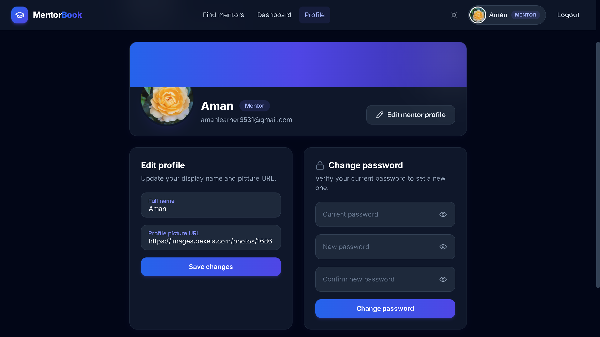
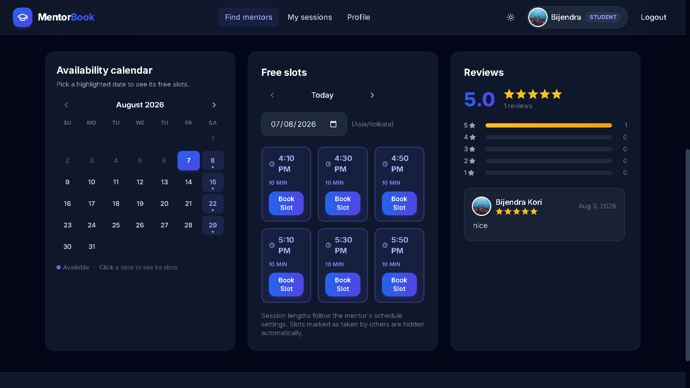
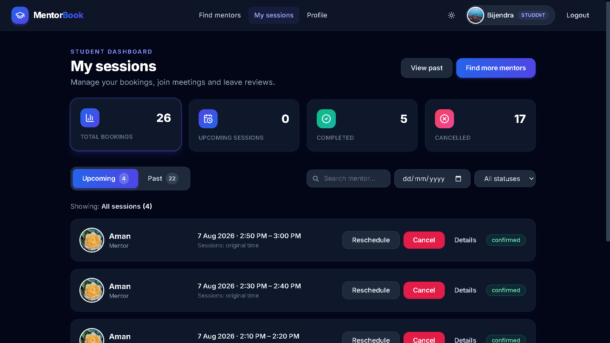
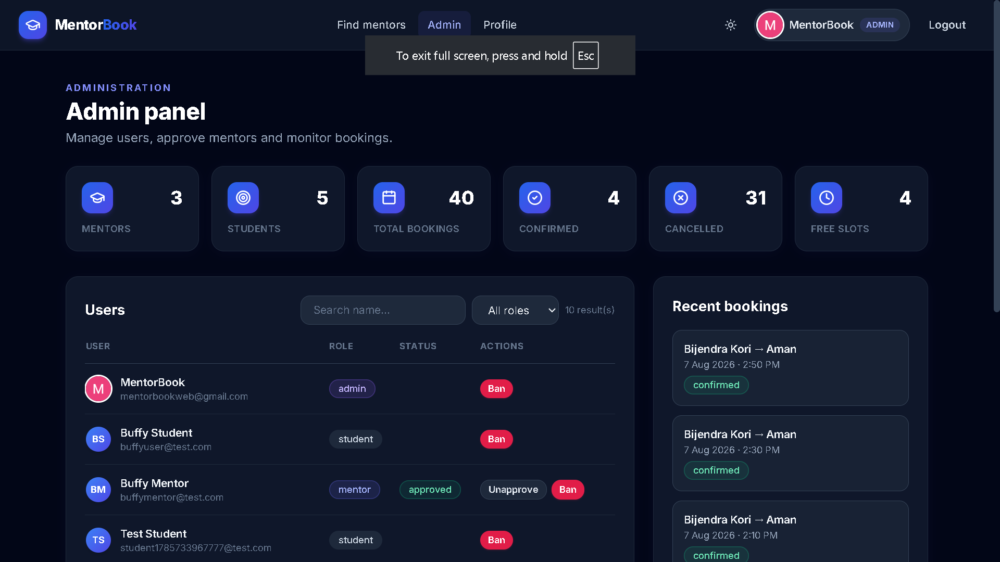
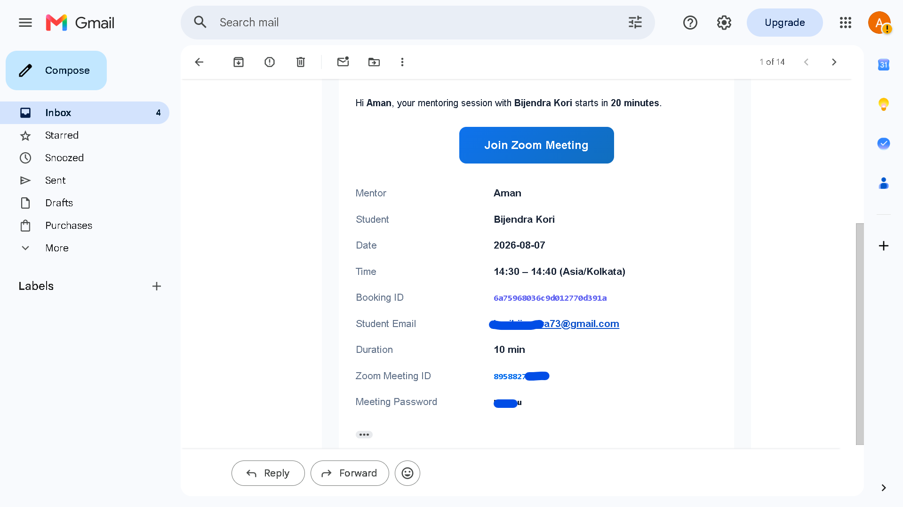

<div align="center">

# 🎓 MentorBook – Mentor Booking System

**A full-stack web application where students can discover mentors, browse their real-time availability, and book 1-on-1 mentorship sessions — with automated scheduling, email notifications, and built-in video meeting links.**

[](https://react.dev)
[](https://nodejs.org)
[](https://www.mongodb.com)
[](https://expressjs.com)
[](https://jwt.io)
[](https://tailwindcss.com)
[](https://vitejs.dev)

</div>

---

## 🚀 Live Demo

| Platform | URL |
|----------|-----|
| Frontend | https://book-mentor-teal.vercel.app |
| Backend API | https://bookmentor.onrender.com |

---

## ✨ Features

### 🔐 Authentication

- User Registration
- Secure Login
- Google Login
- JWT Authentication
- Forgot Password
- Change Password
- Role-based Access Control

### 🎓 Student Features

- Browse Mentors
- View Mentor Profiles
- View Available Time Slots
- Book Sessions
- Cancel Booking
- Reschedule Booking
- View Booking History
- Leave Ratings & Reviews after completed sessions
- Email Confirmation
- Reminder Email before session

### 👨‍🏫 Mentor Features

- Create Availability
- Weekly Availability
- Custom Date Availability
- Block Dates / Time Off (vacation, personal leave, holidays)
- Session Duration Settings
- Custom Buffer Time
- Dynamic Slot Generation
- Manage Upcoming Sessions
- Complete Sessions
- Cancel Sessions
- View Student Reviews

### 📅 Booking System

- Dynamic Slot Generation
- Buffer Time Between Sessions
- Prevent Double Booking (concurrency-safe via unique partial index)
- Automatic Availability Updates
- Session Status Tracking
- Booking Validation
- Automatic Zoom Meeting creation with join link & password (included in emails)
- Google Meet fallback when Zoom is not configured

### 📧 Notifications

- Booking Confirmation Emails
- Session Reminder Emails (20 minutes before the session)
- Booking Cancellation Emails
- Reschedule Notifications
- Session Completion Emails
- Zoom meeting details embedded in confirmation & reminder emails

### 🛠️ Admin Features

- Dashboard
- Manage Users
- Manage Mentors
- Manage Students
- Review Management

---

## 🛠️ Tech Stack

### Frontend

- React
- Vite
- React Router
- Axios
- Tailwind CSS

### Backend

- Node.js
- Express.js
- MongoDB
- Mongoose
- JWT
- Nodemailer
- Google OAuth

> **Also used:** `bcrypt` (password hashing), `node-cron` (reminders & background jobs), Google Calendar API (auto Meet links), Zoom Server-to-Server OAuth API (meeting generation).

---

## 📁 Folder Structure

```
mentor-book/
│
├── client/                          # React + Vite frontend
│   ├── src/
│   │   ├── api/                     # Axios client & API calls
│   │   ├── components/              # Reusable UI components
│   │   ├── context/                 # Auth, Theme & Toast providers
│   │   ├── data/                    # Static data (expertise categories)
│   │   ├── pages/                   # Application screens
│   │   ├── utils/                   # Time & Google helpers
│   │   ├── App.jsx
│   │   ├── main.jsx
│   │   └── index.css                # Tailwind styles
│   ├── index.html
│   ├── tailwind.config.js
│   └── vite.config.js
│
└── server/                          # Node.js + Express backend
    ├── config/                      # Database & Google OAuth setup
    ├── controllers/                 # Route handlers
    ├── middlewares/                 # Auth protection & error handling
    ├── models/                      # Mongoose models
    ├── routes/                      # API route definitions
    ├── services/                    # Mailer, cron, meetings, slot logic, Zoom
    ├── utils/                       # Time, JWT & error helpers
    └── server.js                    # Application entry point
```

---

## 🚀 Installation

### Clone Repository

```bash
git clone YOUR_GITHUB_REPOSITORY
cd mentor-book
```

### Install Frontend

```bash
cd client
npm install
npm run dev
```

> The frontend runs on `http://localhost:5173` and proxies `/api` to the backend automatically in development.

### Install Backend

```bash
cd server
npm install
npm run dev
```

> The backend runs on `http://localhost:5000`.

---

## 🔧 Environment Variables

Create a `.env` file in each folder by copying the provided `.env.example` template.

### Frontend (`client/.env`)

```env
VITE_API_URL=
VITE_GOOGLE_CLIENT_ID=
```

### Backend (`server/.env`)

```env
PORT=
MONGO_URI=
JWT_SECRET=
CLIENT_URL=
EMAIL_HOST=
EMAIL_PORT=
EMAIL_USER=
EMAIL_PASS=
EMAIL_FROM=
GOOGLE_CLIENT_ID=
GOOGLE_CLIENT_SECRET=
```

> **Optional (extra features):**
> ```env
> EMAIL_ENABLED=true                 # false → emails are logged to the console instead
> ADMIN_EMAILS=admin@example.com     # comma-separated emails that become admins
> AUTO_APPROVE_MENTORS=true          # false → admins must approve mentors manually
> ZOOM_ACCOUNT_ID=                   # Server-to-Server OAuth (auto Zoom meetings)
> ZOOM_CLIENT_ID=
> ZOOM_CLIENT_SECRET=
> ```

---

## 🌐 API Overview

All endpoints are prefixed with `/api`.

### 🔐 Authentication

| Method | Endpoint | Description |
|--------|----------|-------------|
| POST | `/api/auth/register` | Register as a student or mentor |
| POST | `/api/auth/login` | Login and receive a JWT |
| POST | `/api/auth/google` | Login with Google |
| GET | `/api/auth/me` | Get current user + profile |
| PATCH | `/api/auth/me` | Update profile |
| POST | `/api/auth/forgot-password` | Request a password reset link |
| POST | `/api/auth/reset-password/:token` | Reset password using the token |
| PATCH | `/api/auth/change-password` | Change password (logged in) |

### 👨‍🏫 Mentors

| Method | Endpoint | Description |
|--------|----------|-------------|
| GET | `/api/mentors` | Search / filter / paginate mentors |
| GET | `/api/mentors/:id` | Mentor profile details |
| GET | `/api/mentors/me` | Mentor's own profile |
| PATCH | `/api/mentors/me` | Update mentor profile & scheduling settings |

### 📅 Availability

| Method | Endpoint | Description |
|--------|----------|-------------|
| GET | `/api/availability/mentors/:id?date=` | Free slots + booked ranges for a date |
| GET | `/api/availability/me` | Mentor's own availability |
| POST | `/api/availability` | Add a slot (one-off or weekly recurring) |
| PATCH | `/api/availability/:id` | Update a slot |
| DELETE | `/api/availability/:id` | Delete a slot |
| POST | `/api/availability/blocked-dates` | Block a date (time off) |
| DELETE | `/api/availability/blocked-dates/:date` | Unblock a date |

### 📆 Bookings

| Method | Endpoint | Description |
|--------|----------|-------------|
| POST | `/api/bookings` | Book a slot (concurrency-safe) |
| GET | `/api/bookings/my-bookings` | Student's booking history |
| GET | `/api/bookings/mentor-bookings` | Mentor's upcoming sessions |
| POST | `/api/bookings/:id/cancel` | Cancel a booking (student or mentor) |
| POST | `/api/bookings/:id/reschedule` | Reschedule a booking (student or mentor) |
| POST | `/api/bookings/:id/complete` | Mark a session completed (mentor) |

### ⭐ Reviews

| Method | Endpoint | Description |
|--------|----------|-------------|
| GET | `/api/reviews/mentors/:id` | Reviews for a mentor |
| GET | `/api/reviews/mine` | Student's own reviews |
| POST | `/api/reviews` | Add a review after a completed session |
| PATCH | `/api/reviews/:id` | Update a review |
| DELETE | `/api/reviews/:id` | Delete a review |

### 🛠️ Admin

| Method | Endpoint | Description |
|--------|----------|-------------|
| GET | `/api/admin/stats` | Dashboard statistics |
| GET | `/api/admin/users` | List all users |
| PATCH | `/api/admin/users/:id` | Approve / ban / update a user |
| GET | `/api/admin/bookings` | View all bookings |

---

## 📸 Screenshots

### Home Page


---

### Login



---

### Student Dashboard

(Add Screenshot Here)

---

### Mentor Dashboard



---

### Mentor Availability



---

### Mentor Profile



---

### Available Slots, Booking Page And  Reviews



---

### My Sessions



---

### Admin Dashboard



---

### Email Notification



---

## 🔒 Security

- JWT Authentication
- Password Hashing (bcrypt)
- Protected Routes
- Role Based Authorization
- Input Validation
- Duplicate Booking Prevention

---

## 🚀 Future Improvements

- Calendar Integration
- Video Meeting Integration
- Payment Gateway
- Mobile App
- Push Notifications
- Analytics Dashboard

---

## 📄 License

This project is licensed under the **MIT License**.

---

## 👤 Author

**Name:** Rajat Dhariya

**GitHub:** https://github.com/dhariyarajat

**LinkedIn:** https://www.linkedin.com/in/rajat-dhariya-754413377

